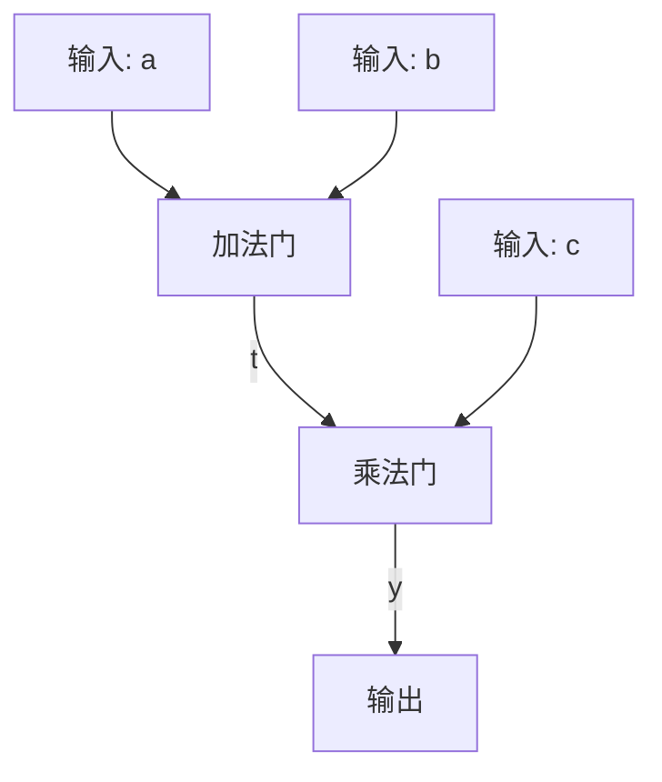

## 问题陈述

我们正在证明的问题是：给定一个声称的输出 y，证明者知道输入 a, b, c，使得 (a + b) * c = y。

## 证明过程解析

### 1. 算术电路表示



这个电路图形象地表示了计算过程。

### 2. C-SAT 问题表述

给定输出值 y，我们需要证明存在 a, b, c 和中间值 t，满足：
1. t = a + b
2. y = t * c

这实际上是在证明我们知道一组满足电路的输入。

### 3. 规约到代数约束系统（ACS）

将问题转化为代数约束：
1. t - (a + b) = 0
2. y - (t * c) = 0

这一步将电路的行为转换为数学等式。

### 4. 转换为 R1CS

对于变量向量 x = [1, a, b, c, t, y]，我们有：
- 约束1：(1, 0, 0, 0, 1, 0) · x * (1, 0, 0, 0, 0, 0) · x = (0, 1, 1, 0, 0, 0) · x
- 约束2：(1, 0, 0, 0, 1, 0) · x * (0, 0, 0, 1, 0, 0) · x = (0, 0, 0, 0, 0, 1) · x

R1CS 是一种标准化的格式，便于后续处理。

### 5. 多项式表示

构造多项式 P(X)，使得：
P(0) = t - (a + b)
P(1) = y - (t * c)

满足 C-SAT 问题等价于找到使 P(0) = P(1) = 0 的赋值。

## 如何利用证明系统生成证明

1. **设置阶段**：
   - 生成证明系统的公共参数（如椭圆曲线参数）。
   - 将 R1CS 或多项式表示转换为证明系统特定的格式（如 QAP 用于 Groth16）。

2. **证明生成**：
   - 证明者使用私密输入（a, b, c）和中间值（t）。
   - 使用这些值和公共参数生成一个证明 π。
   - 证明 π 包含加密的承诺，表明证明者知道满足所有约束的值。

3. **验证**：
   - 验证者接收证明 π 和公开输出 y。
   - 使用公共参数验证 π 是否有效，而无需知道私密输入。

## 具体示例（使用简化的 Groth16 类型系统）

```python
import random

# 简化的证明系统
class SimplifiedGroth16:
    def __init__(self, r1cs):
        self.r1cs = r1cs
        self.secret = random.randint(1, 1000)  # 模拟加密参数

    def generate_proof(self, x):
        # 简化的证明生成
        proof = sum(constraint.satisfy(x) * self.secret for constraint in self.r1cs)
        return proof

    def verify(self, proof, y):
        # 简化的验证
        expected = y * self.secret
        return abs(proof - expected) < 1e-10

# R1CS 约束
class R1CS:
    def __init__(self, a, b, c):
        self.a = a
        self.b = b
        self.c = c

    def satisfy(self, x):
        return sum(a*x[i] for i, a in enumerate(self.a)) * \
               sum(b*x[i] for i, b in enumerate(self.b)) == \
               sum(c*x[i] for i, c in enumerate(self.c))

# 设置 R1CS
r1cs1 = R1CS([1,0,0,0,1,0], [1,0,0,0,0,0], [0,1,1,0,0,0])
r1cs2 = R1CS([1,0,0,0,1,0], [0,0,0,1,0,0], [0,0,0,0,0,1])
r1cs_system = [r1cs1, r1cs2]

# 初始化证明系统
proof_system = SimplifiedGroth16(r1cs_system)

# 生成证明
a, b, c = 2, 3, 4
t = a + b
y = t * c
x = [1, a, b, c, t, y]
proof = proof_system.generate_proof(x)

# 验证证明
is_valid = proof_system.verify(proof, y)
print(f"证明是否有效: {is_valid}")
```

这个例子证明了证明者知道满足 (a + b) * c = y 的 a, b, c 值，而无需揭示这些具体值。证明系统确保了：

1. **完备性**：诚实的证明者总能生成有效证明。
2. **可靠性**：如果等式不成立，证明者几乎不可能生成有效证明。
3. **零知识性**：验证者无法从证明中推导出 a, b, c 的具体值。